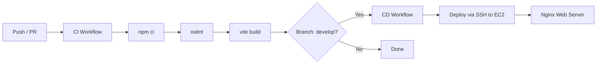

# 🧩 Sudoku Pro

<div align="center">


**A modern, highly interactive, and visually stunning Sudoku web application.**  
Engineered with React 19, Vite, Tailwind CSS v4, and dynamic Web Audio effects for an unparalleled puzzle-solving experience.

[](https://react.dev/)
[](https://vitejs.dev/)
[](https://tailwindcss.com/)
[](https://oxc.rs/)
[](.github/workflows/)
[](LICENSE)

[Features](#-key-features) • [Tech Stack](#-tech-stack) • [Quick Start](#-quick-start) • [Controls & Shortcuts](#-controls--keyboard-shortcuts) • [Architecture](#-project-structure) • [CI/CD](#-cicd-pipeline)

</div>

---

## 📖 Table of Contents

- [🌟 Overview](#-overview)
- [✨ Key Features](#-key-features)
- [🎨 Themes & Aesthetics](#-themes--aesthetics)
- [🛠️ Tech Stack](#-tech-stack)
- [🚀 Quick Start](#-quick-start)
- [⌨️ Controls & Keyboard Shortcuts](#-controls--keyboard-shortcuts)
- [🏗️ Project Structure](#-project-structure)
- [⚙️ Game Mechanics & Algorithms](#️-game-mechanics--algorithms)
- [🔄 CI/CD Pipeline](#-cicd-pipeline)
- [🤝 Contributing](#-contributing)
- [📜 License](#-license)

---

## 🌟 Overview

**Sudoku Pro** is a feature-rich, high-performance web-based Sudoku game crafted to deliver an engaging puzzle-solving experience for both casual players and hard-core logic enthusiasts. Combining a modern glassmorphism design with responsive tactile feedback, procedural Web Audio generation, and smart solver algorithms, Sudoku Pro elevates classic Sudoku to the modern web.

---

## ✨ Key Features

- **🎮 Immersive Gameplay**:
  - **4 Difficulty Levels**: Easy, Medium, Hard, and Expert.
  - **Pencil/Notes Mode**: Write candidate numbers in any cell to test strategies.
  - **Auto-Candidate Filler**: Automatically populate all valid candidates across the entire grid.
  - **Smart Step-by-Step Hints**: Highlight logical deductions (Single Candidates, Hidden Singles, Elimination) with pedagogical explanations.
  - **Multi-Level Undo/Redo**: Full state history management (`Ctrl+Z` / `Ctrl+Y`).
  - **Strict Mode**: Optional mistake limiter (3 strikes and game over).

- **🎨 Modern Design & Dynamic Themes**:
  - **5 Curated Themes**:
    - ⚡ *Cyber Neon* (High-contrast futuristic glow)
    - 🌌 *Aurora Glow* (Vibrant emerald & indigo hues)
    - 🌅 *Sunset Amber* (Warm amber, rose, and gold tones)
    - 🌊 *Midnight Blue* (Deep oceanic navy and cyan)
    - ☀️ *Daylight Clean* (Crisp, distraction-free daylight palette)
  - **Kinetic 3D Board Tilt**: Subtle parallax perspective that tracks cursor position.
  - **Micro-Animations & Ripple Effects**: Interactive ripple shockwaves on correct placements, pop combos, and shake animations on mistakes.
  - **Victory Celebrations**: Dynamic full-screen confetti bursts powered by `canvas-confetti`.

- **🔊 Synthesized Procedural Audio**:
  - Zero external `.mp3`/`.wav` assets. Built entirely with the browser's native **Web Audio API**.
  - Dynamic tones for placement, error buzzers, note toggles, erase pops, combos, and victory fanfares.
  - Easily toggled via UI settings.

- **📊 Comprehensive Statistics & Persistence**:
  - Tracks games played, win rate, current/best winning streaks, best times, and average times per difficulty.
  - Full **LocalStorage** persistence: auto-saves in-progress games, timer, pencil notes, and player preferences.

- **🧩 Custom Puzzle Solver & Scanner**:
  - Enter custom Sudoku boards from newspapers or external sources.
  - Instant validation and one-click solving using an optimized backtracking algorithm.

- **💡 Sudoku Trivia & Facts Panel**:
  - Explore fun historical and mathematical facts about Sudoku directly in the side panel.

---

## 🎨 Themes & Aesthetics

| Theme | Aesthetic Description | Ideal For |
|---|---|---|
| **Cyber Neon** | High-energy violet, neon magenta, and laser cyan | Night sessions & cyberpunk lovers |
| **Aurora Glow** | Deep cosmic dark with shimmering boreal greens | Relaxed, ambient solving |
| **Sunset Amber** | Warm sunset gradients with glowing orange accents | Evening relaxation |
| **Midnight Blue** | Classic dark mode with royal blues and crisp white digits | Focused, high-contrast clarity |
| **Daylight Clean** | Minimalist light theme with neutral slate styling | Bright environments & daytime play |

---

## 🛠️ Tech Stack

- **Core**: [React 19](https://react.dev/) (Functional Components, Hooks, Context-free lightweight state architecture)
- **Bundler & Dev Server**: [Vite 8](https://vitejs.dev/)
- **Styling**: [Tailwind CSS v4](https://tailwindcss.com/) with `@tailwindcss/vite`
- **Icons**: [Lucide React](https://lucide.dev/)
- **Audio**: Web Audio API (Synthesized Oscillators & Gain Nodes)
- **Linter**: [Oxlint](https://oxc.rs/) (Blazing-fast Rust-based JavaScript/React linter)
- **Animations & FX**: CSS Keyframes, CSS Transforms, [canvas-confetti](https://www.npmjs.com/package/canvas-confetti)
- **CI/CD**: GitHub Actions & Nginx automated deployment

---

## 🚀 Quick Start

### Prerequisites

Ensure you have [Node.js](https://nodejs.org/) (version 18.0.0 or higher) and `npm` installed.

```bash
node -v
npm -v
```

### Installation

1. **Clone the repository**:
   ```bash
   git clone https://github.com/arpitrai11/Sudoku.git
   cd Sudoku
   ```

2. **Install dependencies**:
   ```bash
   npm install
   ```

3. **Start the local development server**:
   ```bash
   npm run dev
   ```

4. **Launch the app**:
   Open your browser and navigate to:
   ```text
   http://localhost:5173
   ```

### Available Scripts

| Command | Description |
|---|---|
| `npm run dev` | Starts the Vite development server with Hot Module Replacement (HMR). |
| `npm run build` | Compiles and bundles production-ready assets into the `dist/` directory. |
| `npm run preview` | Locally serves the production build from `dist/` for inspection. |
| `npm run lint` | Runs `oxlint` to quickly catch syntax errors and React code issues. |

---

## ⌨️ Controls & Keyboard Shortcuts

Sudoku Pro includes first-class keyboard navigation for smooth, high-speed input:

| Key | Action |
|---|---|
| `1` – `9` / `Numpad 1` – `9` | Place number or pencil note in selected cell |
| `Arrow Keys` or `W` `A` `S` `D` | Navigate grid selection |
| `Backspace` / `Delete` | Erase number or notes in selected cell |
| `N` | Toggle Pencil / Notes Mode |
| `H` | Request Smart Hint |
| `Ctrl` + `Z` / `Cmd` + `Z` | Undo last move |
| `Ctrl` + `Y` / `Cmd` + `Shift` + `Z` | Redo move |
| `Escape` | Close active modal or clear selection |

---

## 🏗️ Project Structure

```text
Sudoku/
├── .github/
│   └── workflows/
│       ├── ci.yml                 # Automated linting & build verification workflow
│       └── cd.yml                 # Automated deployment pipeline to AWS EC2
├── public/                        # Static public assets
├── src/
│   ├── assets/                    # Project images, SVGs, and brand assets
│   ├── components/                # React UI Components
│   │   ├── CustomSolverModal.jsx  # Custom puzzle input & solver modal
│   │   ├── FactsPanel.jsx         # Interactive Sudoku trivia & history panel
│   │   ├── GameControls.jsx       # Action buttons (Undo, Redo, Notes, Hint, Erase)
│   │   ├── HowToPlayModal.jsx     # Rules, strategies, and guide dialog
│   │   ├── Navbar.jsx             # Top bar with themes, difficulty, timer, mistakes
│   │   ├── Numpad.jsx             # On-screen tactile input keypad with frequency counts
│   │   ├── StatsModal.jsx         # Detailed gameplay analytics & streak modal
│   │   ├── SudokuGrid.jsx         # Interactive 9x9 board with 3D tilt & animations
│   │   └── VictoryModal.jsx       # Win screen with performance stats & confetti
│   ├── utils/
│   │   ├── soundEffects.js        # Web Audio API procedural synthesizer
│   │   ├── storage.js             # LocalStorage state & stats synchronization
│   │   └── sudokuGenerator.js     # Backtracking solver, generator & hint logic
│   ├── App.css                    # Component specific styles & layout transitions
│   ├── App.jsx                    # Root state coordinator & keyboard event orchestrator
│   ├── index.css                  # Tailwind CSS v4 design tokens, themes & keyframes
│   └── main.jsx                   # Application entry point
├── .gitignore
├── .oxlintrc.json                 # Oxlint configuration
├── index.html                     # HTML5 Shell
├── package.json                   # Project scripts and dependencies
├── vite.config.js                 # Vite + Tailwind plugin configuration
└── README.md                      # Documentation
```

---

## ⚙️ Game Mechanics & Algorithms

### 1. Board Generation & Difficulty Tuning
- Generates a fully solved, valid 9x9 Sudoku grid using randomized backtracking.
- Removes numbers according to the selected difficulty tier while ensuring the puzzle remains uniquely solvable.

### 2. Smart Hint Engine
- Analyzes the current board state against the pre-calculated solution.
- Identifies **Naked Singles** (cells where only one candidate digit is mathematically possible), **Hidden Singles**, or row/column eliminations, outputting educational descriptions.

### 3. Custom Solver
- Employs a recursive constraint satisfaction backtracking algorithm capable of solving valid 9x9 Sudoku puzzles in milliseconds.

---

## 🔄 CI/CD Pipeline

Sudoku Pro includes automated GitHub Actions workflows for continuous integration and continuous deployment:



- **Continuous Integration (`ci.yml`)**:
  - Triggers on every push and pull request to `main` and `develop`.
  - Installs dependencies using clean install (`npm ci`).
  - Runs fast linting via `oxlint`.
  - Builds production bundle (`npm run build`) to ensure zero regression.

- **Continuous Deployment (`cd.yml`)**:
  - Triggers automatically upon pushing to the `develop` branch.
  - Connects to AWS EC2 via SSH (`appleboy/ssh-action`).
  - Pulls latest code, builds production assets, and serves them seamlessly via **Nginx**.

---

## 🤝 Contributing

Contributions, feature suggestions, and bug reports are welcome!

1. Fork the repository
2. Create your feature branch (`git checkout -b feature/AmazingFeature`)
3. Commit your changes (`git commit -m 'feat: Add some AmazingFeature'`)
4. Push to the branch (`git push origin feature/AmazingFeature`)
5. Open a Pull Request

---

## 📜 License

This project is open-source and available under the **MIT License**.

<div align="center">
  <sub>Built with ❤️ for puzzle enthusiasts worldwide.</sub>
</div>
